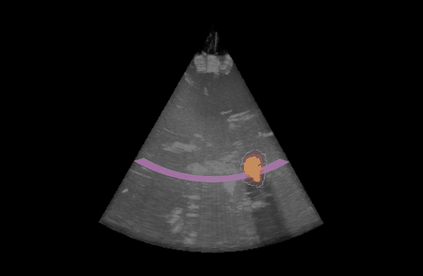
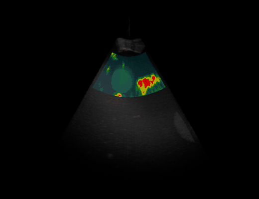
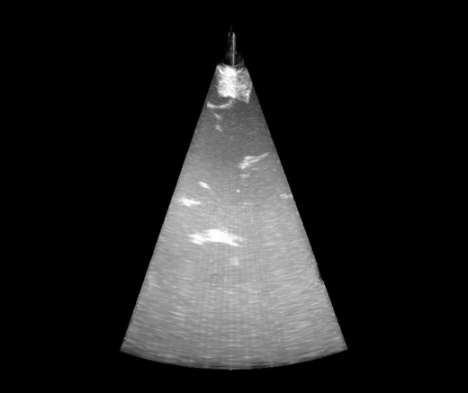
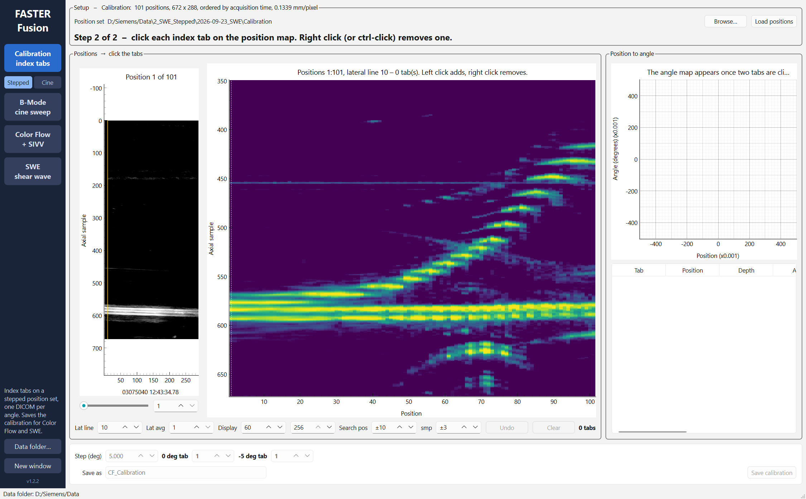
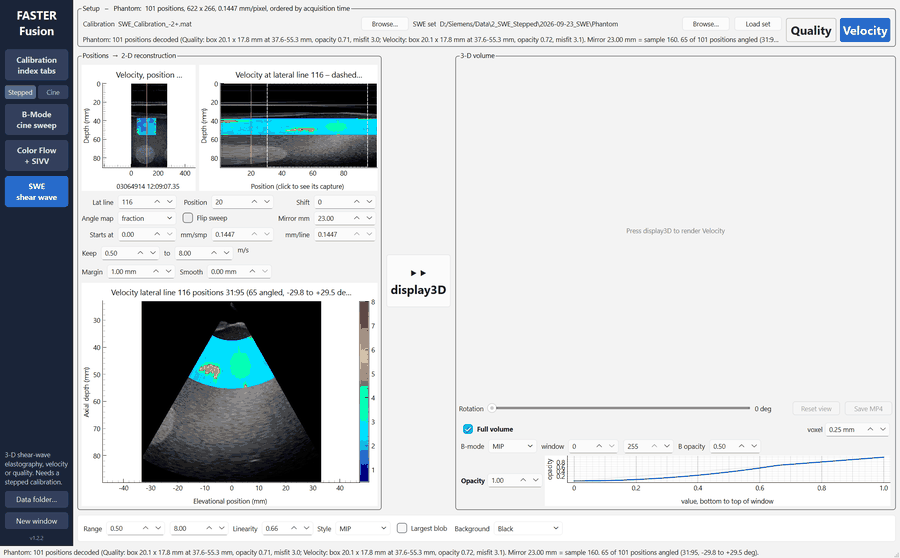
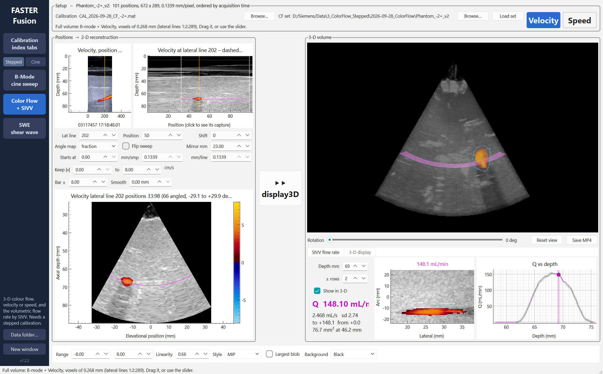
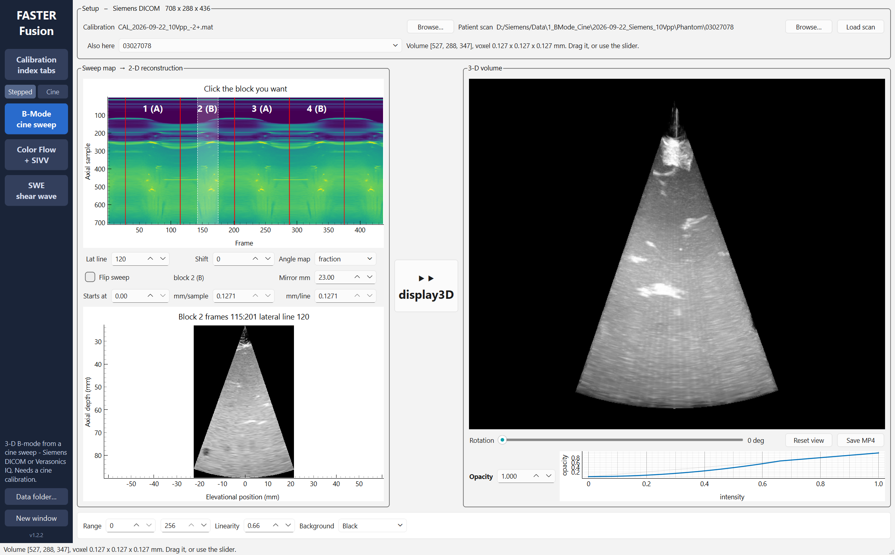
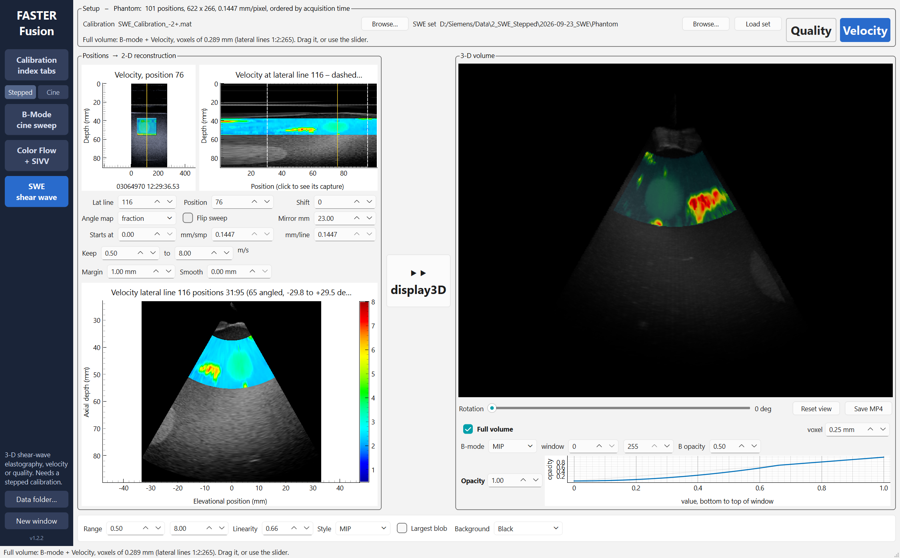

# FASTER Fusion

**Turn a mirror-swept 2-D ultrasound probe into a 3-D scanner.** FASTER Fusion calibrates the
sweep, reconstructs the captured frames into a volume, and shows it in 3-D: B-mode, colour
flow (with the volumetric flow rate, SIVV) and shear-wave elastography (SWE). No MATLAB or
Python needed to run it.

<p align="center">
  
  
  
</p>
<p align="center"><sub>Colour flow &nbsp;·&nbsp; SWE &nbsp;·&nbsp; B-mode, all reconstructed from phantom scans. Every volume can be dragged, rotated and saved as an MP4.</sub></p>

## Download

| | |
|---|---|
| **Windows 10/11** | [**FASTER-Fusion-1.2.2-Setup.exe**](https://github.com/dongliang-yan/FASTER-Fusion/releases/latest): the installer; it adds a Start Menu entry and an optional Desktop shortcut.<br>Or the portable [`-Windows.zip`](https://github.com/dongliang-yan/FASTER-Fusion/releases/latest): unzip anywhere and run `FASTER Fusion.exe`. |
| **macOS (Apple silicon)** | [**FASTER-Fusion-1.2.2-macOS.dmg**](https://github.com/dongliang-yan/FASTER-Fusion/releases/latest): open it and drag **FASTER Fusion** to Applications. |

All downloads are on the **[Releases page](https://github.com/dongliang-yan/FASTER-Fusion/releases/latest)**.

- *Windows:* if SmartScreen says "Windows protected your PC", choose **More info → Run anyway**. The app isn't code-signed.
- *macOS:* the first time, **right-click → Open → Open**, for the same reason.

## How it works

The probe's image plane is swept by a rotating mirror, so each captured frame is a slice at a
different angle. Two steps turn those slices into a volume:

1. **Calibrate.** Scan a fixture with index tabs and click the tabs. The app fits the sweep
   angle of every frame and saves it as a `.mat` calibration (compatible with the MATLAB GUIs).
2. **Reconstruct.** Load a scan plus its calibration, check the 2-D result, and press
   **display3D**.

<p align="center"></p>
<p align="center"><sub><b>1. Calibration.</b> The position map shows the index tabs as bright tracks; click them to fit the angle of every position.</sub></p>

### Scan through the positions, then see the volume

<p align="center"></p>
<p align="center"><sub><b>SWE.</b> Step through the captured positions (top left), watch the 2-D reconstruction update (bottom), then render the 3-D volume (right).</sub></p>

### Colour flow and flow rate

<p align="center"></p>
<p align="center"><sub><b>Colour flow + SIVV.</b> Velocity or speed volume over B-mode, with the volumetric flow rate: here 148.1 mL/min at 69 mm depth.</sub></p>

### B-mode

<p align="center"></p>
<p align="center"><sub><b>B-mode.</b> Click a sweep block on the cine map, check the 2-D frame, then render it. Reads Siemens DICOM and Verasonics IQ.</sub></p>

<p align="center"></p>

| mode | what it does | matches the MATLAB |
|---|---|---|
| **Calibration → Stepped** | index tabs on a stepped position set (for Color Flow, SWE) | `Calibration_CF` |
| **Calibration → Cine** | index tabs on a continuous cine (for B-Mode) | `Calibration_GUI_v1` |
| **B-Mode** | Siemens DICOM cine or Verasonics IQ | `Recon_v1` |
| **Color Flow** | velocity/speed volume and SIVV flow rate | `Recon_CF_v2` |
| **SWE** | velocity/quality volume | `Recon_SWE` |

It's the MATLAB **FASTER_Fusion** ported to Python, with the same modes, layouts and numbers
(the agreement is tabulated under *Validation against MATLAB* below).

---

## Install and run

**macOS:** open `FASTER-Fusion-1.2.2-macOS.dmg` and drag **FASTER Fusion** to Applications.
The app isn't code-signed, so the first time you open it, **right-click → Open → Open**.
After that it opens normally.

**Windows:** run `FASTER-Fusion-1.2.2-Setup.exe` (adds Start Menu and optional Desktop shortcuts), or unzip `FASTER-Fusion-1.2.2-Windows.zip` anywhere and run
`FASTER Fusion\FASTER Fusion.exe`. See *Building* for how the zip is made.

**Data:** the file dialogs start in your **Data** folder. It's found automatically next to
the app's source tree, or you can set it with **Data folder…** on the rail (remembered).
`Data/README.md` says which calibration goes with which scan.

**Saving:** calibrations are saved by default into the session folder they came from, as
`CAL_<session>_<direction>.mat`, so they sit next to the scans they're for. `.mat`
calibrations are read and written in MATLAB's format, so the app and the MATLAB GUIs can
use each other's files.

**Checking an install:** this loads a colour-flow session, reconstructs it, computes SIVV,
writes a report and quits:

```bash
"/Applications/FASTER Fusion.app/Contents/MacOS/FASTER Fusion" --selftest ".../Data" report.txt
```

On the phantom sets the report ends `SIVV Q = 148.10 mL/min at 69.24 mm`, `RESULT OK`.

## How it's built

```
faster_fusion/
  core/          the algorithms, with no GUI (numpy/scipy)
    mlcompat.py    MATLAB built-ins numpy doesn't reproduce: findpeaks, round,
                   movmean/movmedian, imresize3, imgaussfilt, interp1, max(A(:))
    io.py          stepped sets (loadPositionStack/loadCFStack), cines and IQ (loadScanStack)
    sweep.py       findSweepBlocks, beamscopeSweep
    sector.py      SectorRecon, with the weights built once for all lateral lines
    tabs.py        tab snapping, spacing, the angle fit (both calibrations)
    decode.py      colour-flow bar + decode, SWE bars + blend inversion
    recon.py       calibrations, angles, NaN-aware sweeps, volumes, SIVV
  ui/            PySide6 (Qt) pages; 2-D in pyqtgraph, 3-D in VTK (pyvista)
tests/
  test_core_vs_matlab.py   the port against MATLAB outputs on the real data
  test_core_synthetic.py   MATLAB semantics; SIVV against a closed-form flow rate
  make_reference.m         writes tests/ref/*.mat from the MATLAB originals
packaging/                 PyInstaller spec, icon, build scripts
```

## Validation against MATLAB

`tests/test_core_vs_matlab.py` runs every stage on the real data and compares it with the
MATLAB output (`tests/ref`, written by `make_reference.m`):

| stage | agreement |
|---|---|
| stepped-set loading (every pixel of every position) | identical |
| colour-flow bar, decode, box, misfit | identical (velocities to 1e-6) |
| SWE bars, opacity fit, decode | identical |
| cine JPEG decode → grey | identical (max difference 0) |
| Verasonics IQ log compression | to 1e-4 grey levels |
| turnarounds, sweep blocks, direction classes | identical |
| B-mode 2-D frame | to 8e-12 |
| tab snapping + angle fit from the same clicks | to 4e-15 |
| colour-flow 2-D frame, SIVV Q profile | to 1e-9 |
| 3-D volume; isotropic resample | identical; to 2.4e-7 (7 of 11 M voxels sit on the empty/non-empty threshold) |

In the packaged app, `--selftest` gives Q = 148.10 mL/min, the same as MATLAB `Recon_CF_v2`.

## Developing

```bash
python3 -m venv .venv
.venv/bin/pip install -r requirements.txt
.venv/bin/python -m faster_fusion colorflow      # run from source
.venv/bin/python -m pytest -q                     # tests (the MATLAB ones need ../Data)
```

## Building

**macOS** (on a Mac): `bash packaging/build_mac.sh` → `dist/FASTER Fusion.app` and
`dist/FASTER-Fusion-<version>-macOS.dmg`. The app is built for the Mac's own architecture
(Apple silicon here).

**Windows** (on a Windows PC, Python 3.12):

```bat
py -3.12 -m venv .venv
.venv\Scripts\pip install -r requirements.txt
packaging\build_windows.bat
```

→ `dist\FASTER Fusion\FASTER Fusion.exe` and `dist\FASTER-Fusion-<version>-Windows.zip`.
A Windows app has to be built on Windows. If the folder is on GitHub,
`.github/workflows/build.yml` builds both platforms on GitHub's machines and attaches the
dmg and zip to each run.

**Signing:** to get rid of the "unidentified developer" step on macOS, the app needs signing
and notarizing with an Apple Developer ID. On Windows, a code-signing certificate avoids the
SmartScreen prompt. Neither is needed to use the app.

**Publishing a release:** push a version tag and GitHub builds both apps and attaches them to a
Release page (the macOS `.dmg`, the Windows `Setup.exe` and the Windows `.zip`):

```bash
git tag v1.2.2 && git push origin v1.2.2
```

The screenshots and GIFs in `docs/img` are regenerated from the real app by
`docs/make_media.py` (it needs a desktop session and the `Data` folder).
